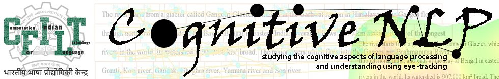

<p align="center"></p>

<hr/>

# Cognition-aware Cognate Detection

The repository which contains our code for our EACL 2021 paper titled, "Cognition-aware Cognate Detection". This work was awarded a best paper honourable mention among the long papers during the conference.


We ask the following pertinent questions with this work:
> “Can cognitive features be used to help the
task of Cognate Detection?”

furthermore,

> “Using gaze features collected on a small set
of data points, can we predict the same features on
a larger set of data points to alleviate the need for
collecting gaze data?”

The paper description, PDF, Slides and Video are available here:
http://dipteshkanojia.github.io/publication/eacl-2021-cognate/

In case you use this data, code or research from this work, you are requested to please cite as follows:

```latex
@inproceedings{kanojia-etal-2021-cognition,
    title = "Cognition-aware Cognate Detection",
    author = "Kanojia, Diptesh  and
      Sharma, Prashant  and
      Ghodekar, Sayali  and
      Bhattacharyya, Pushpak  and
      Haffari, Gholamreza  and
      Kulkarni, Malhar",
    booktitle = "Proceedings of the 16th Conference of the European Chapter of the Association for Computational Linguistics: Main Volume",
    month = apr,
    year = "2021",
    address = "Online",
    publisher = "Association for Computational Linguistics",
    url = "https://aclanthology.org/2021.eacl-main.288",
    pages = "3281--3292",
    abstract = "Automatic detection of cognates helps downstream NLP tasks of Machine Translation, Cross-lingual Information Retrieval, Computational Phylogenetics and Cross-lingual Named Entity Recognition. Previous approaches for the task of cognate detection use orthographic, phonetic and semantic similarity based features sets. In this paper, we propose a novel method for enriching the feature sets, with cognitive features extracted from human readers{'} gaze behaviour. We collect gaze behaviour data for a small sample of cognates and show that extracted cognitive features help the task of cognate detection. However, gaze data collection and annotation is a costly task. We use the collected gaze behaviour data to predict cognitive features for a larger sample and show that predicted cognitive features, also, significantly improve the task performance. We report improvements of 10{\%} with the collected gaze features, and 12{\%} using the predicted gaze features, over the previously proposed approaches. Furthermore, we release the collected gaze behaviour data along with our code and cross-lingual models.",
}

```
## Abstract:

Automatic detection of cognates helps downstream NLP tasks of Machine Translation, Cross-lingual Information Retrieval, Computational Phylogenetics and Cross-lingual Named Entity Recognition. Previous approaches for the task of cognate detection use orthographic, phonetic and semantic similarity based features sets. In this paper, we propose a novel method for enriching the feature sets, with cognitive features extracted from human readers’ gaze behaviour. We collect gaze behaviour data for a small sample of cognates and show that extracted cognitive features help the task of cognate detection. However, gaze data collection and annotation is a costly task. We use the collected gaze behaviour data to predict cognitive features for a larger sample and show that predicted cognitive features, also, significantly improve the task performance. We report improvements of 10% with the collected gaze features, and 12% using the predicted gaze features, over the previously proposed approaches. Furthermore, we release the collected gaze behaviour data along with our code and cross-lingual models.


## Proposed Models


  


## Results


### Setup
Please refer [here](./Setup.md)

### NOTE
In case of any query / issue please:
* Open a github issue  **(OR)**
* Send an email with "[EACL2021 CaCD]" in the subject  to dipteshkanojia [AT] gmail [DOT] com ( or prashaantsharmaa [AT] gmail [DOT] com ) 
  * *Sending the email with subject will make it easier for us to resolve the issue promptly.* 

We will try our best to resolve it as soon as we can. 
