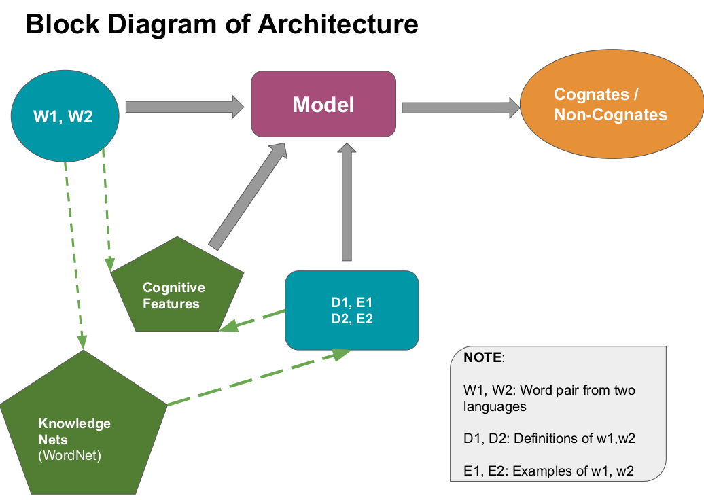
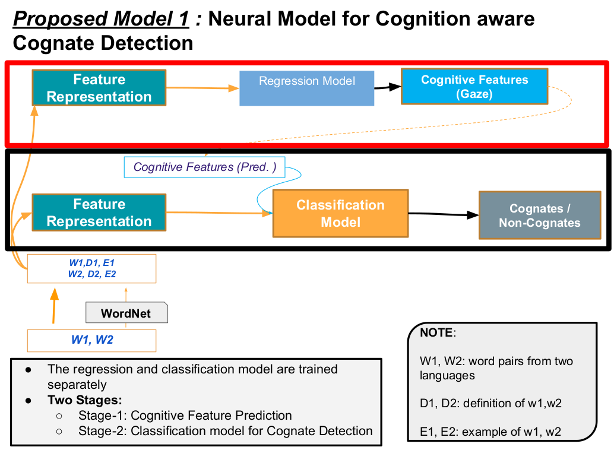
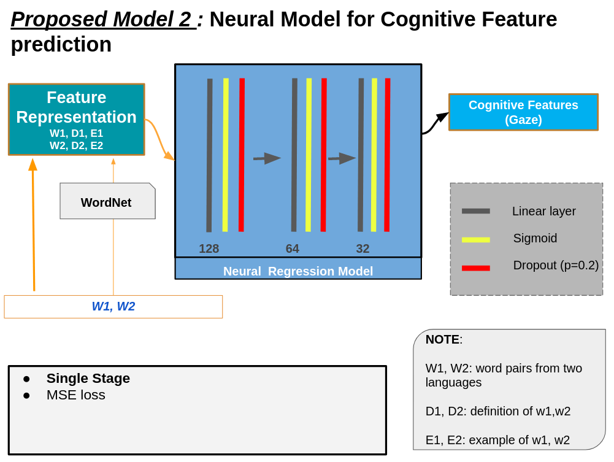
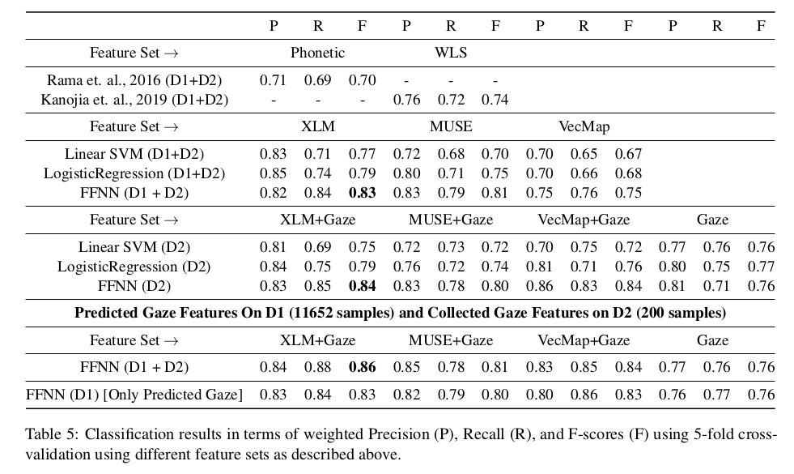

# CaCD: Cognition-aware Cognate Detection

> “Can cognitive features be used to help the
task of Cognate Detection?”

furthermore,

> “Using gaze features collected on a small set
of data points, can we predict the same features on
a larger set of data points to alleviate the need for
collecting gaze data?”

## Abstract:

Automatic detection of cognates helps downstream NLP tasks of Machine Translation,
Cross-lingual Information Retrieval, Computational Phylogenetics and Cross-lingual Named
Entity Recognition. Previous approaches for
the task of cognate detection use orthographic,
phonetic and semantic similarity based features sets. In this paper, we propose a novel
method for enriching the feature sets, with cognitive features extracted from human readers’
gaze behaviour. We collect gaze behaviour
data for a small sample of cognates and show
that extracted cognitive features help the task
of cognate detection. However, gaze data collection and annotation is a costly task. We use
the collected gaze behaviour data to predict
cognitive features for a larger sample and show
that predicted cognitive features, also, significantly improve the task performance. We report improvements of 10% with the collected
gaze features, and 12% using the predicted
gaze features, over the previously proposed
approaches. Furthermore, we release the collected gaze behaviour data along with our code
and cross-lingual models.

## Proposed Models

  

## Results

### NOTE
In case of any query / issue please:
* Open a github issue  **(OR)**
* Send an email dipteshkanojia@gmail.com ( or prashaantsharmaa@gmail.com ) 

We will try to resolve it as soon as we can. 
